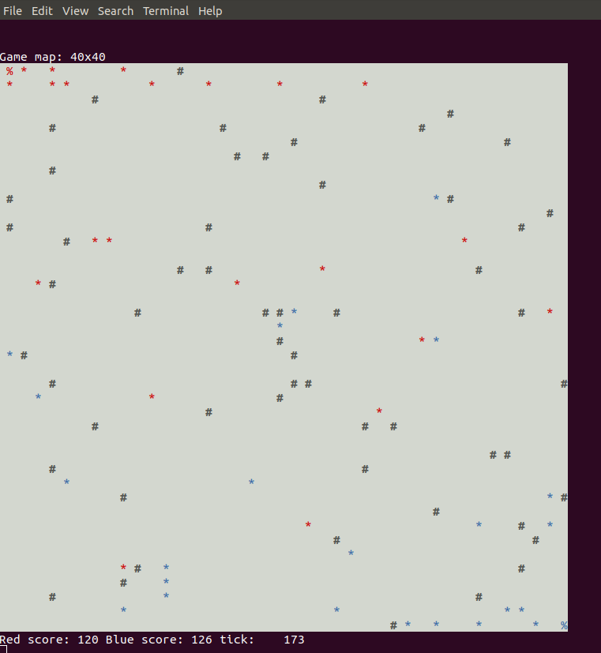

# ros-ant-colony-game
This project is a real time strategy game on a ROS1 stack where two client programs
compete for collecting more sugar for their colony (and they can fight, of cause)

## Installation
- `mkdir -p <antcolony_ws>/src`
- `cd <antcolony_ws>`
- `catkin_make`
- `cd src`
- `git clone https://github.com/rusv/ros-ant-colony-game.git`
- `cd ..`
- `catkin_make`

## How to launch

You will need several terminals. Ensure you run `source devel/setup.bash` in each of them

- Start ROS core: `roscore`
- Start game server: `ANTCOLONY_PLAYER_ONE_TOKEN=SECRET_A ANTCOLONY_PLAYER_TWO_TOKEN=SECRET_B roslaunch antcolony_server game.launch`
- Start first player: `ANTCOLONY_PLAYER_TOKEN=SECRET_A ANTCOLONY_PLAYER_ID=1 rosrun antcolony_client antcolony_client.py`
- Start second player: `ANTCOLONY_PLAYER_TOKEN=SECRET_B ANTCOLONY_PLAYER_ID=2 rosrun antcolony_client antcolony_client.py`
- There are two ways to visualize the board: using Rviz and using console map viewer 

### Rviz visualization

For visualization with Rviz, start it: `rosrun rviz rviz` and add image topic `/antcolony_server_node/game_board_image/image` and you should be able to see

Here is how the board of the game looks in Rviz:

### Console map viewer

For visualization with console map viewer: `rosrun antcolony_server console_map_viewer.py`

Here is how the board of the game looks in console map viewer:

## Rules of game
[Rules of game](./documentation/Rules_Of_Game.md)