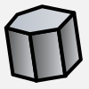
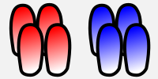
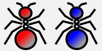

# Rules Of Game

## Board

Antcolony is a ROS-based real time strategy game played by two computer algorithms

Game is played on a square map of size `#define MAP_SIZE 40` until `#define END_TICK 1000`

## Sugar

Ant colonies compete for mining sugar on a board

- Mining of one unit of sugar adds one to a score of a player
- Sugar has initial amount of `#define INITIAL_SUGAR_AMOUNT 10`
- Once completely mined, sugar disappear from the board

## Hive

Each player has one hive in the corner of the map.

- Hive has initial health `#define INITIAL_HIVE_HEALTH 20`
- Hive can be destroyed
- If hive has amount of sugar `#define BABY_ANT_SUGAR INITIAL_ANT_HEALTH` it 
consumes it and starts to grow a baby ant which is ready in `#define INITIAL_ANT_HEALTH`
ticks
- No baby ants will be produced if hive is destroyed

## Ant

Each player can give orders to their ants.

- Players control ants which for each turn can MOVE or ATTACK
- Ant has initial health `#define INITIAL_ANT_HEALTH 5`
- Ant can be killed
- Ant can attack hives, ants and sugars and deal damage `#define HIVE_ATTACK_HIT 1`, `#define ANT_ATTACK_HIT 1` and `#define SUGAR_ATTACK_HIT 1`
- Ant can mine sugar by attacking it

